# Testing ASP project
## For learning purposes

This is the very first project using ASP.Net created with the intention to study the technology itself and some other conventions, protocols, etc.
Throughout the course the following was covered:
* Razor
* Inversion of control
* Single page application aka SPA
* Ways of working with forms
* Display templates
* Concepts of data accessors
* Middlewares
* Filters
* Differences between MVC and API controllers

So here I will list what was implemented as well as some theory I was able to note.

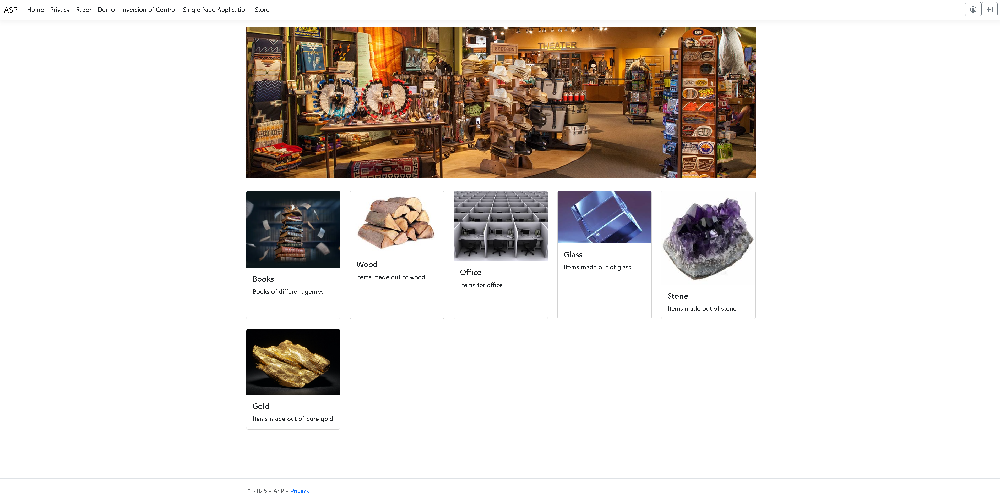
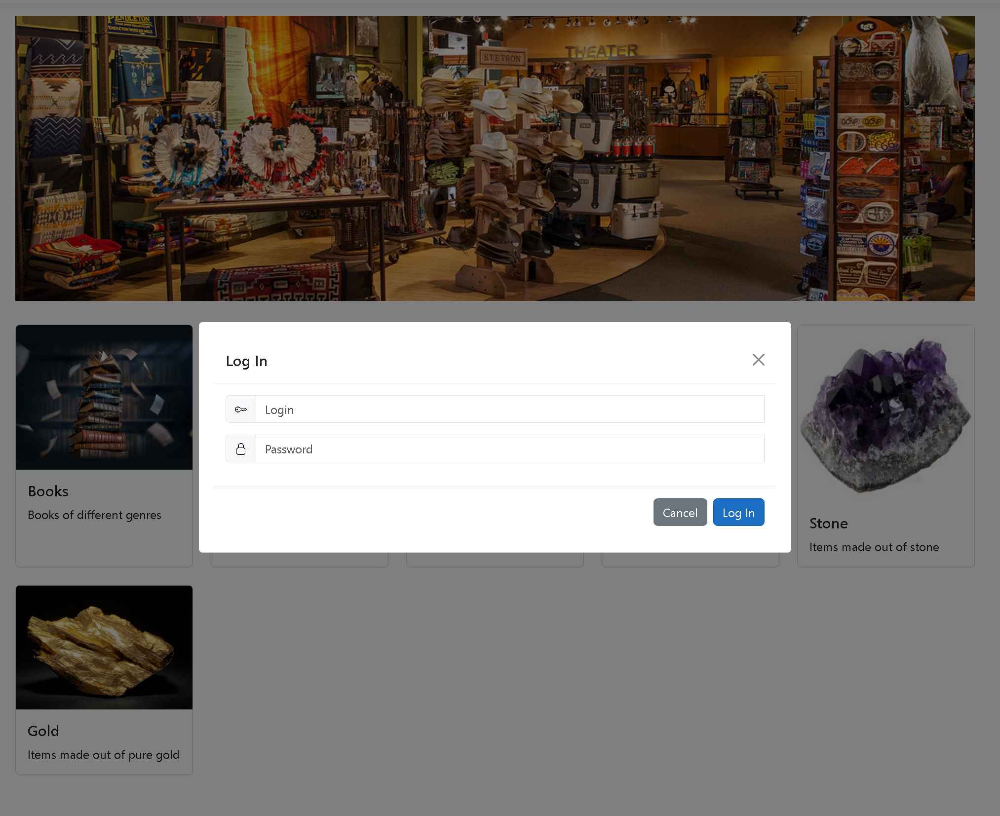
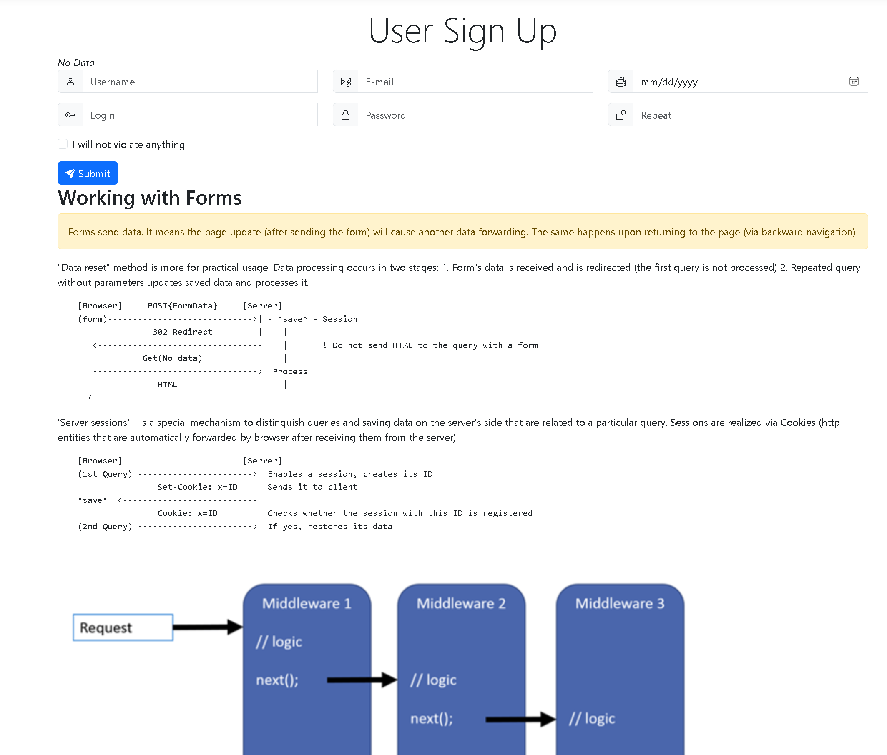
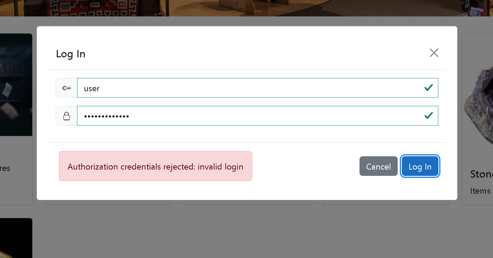
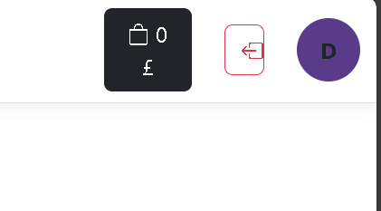
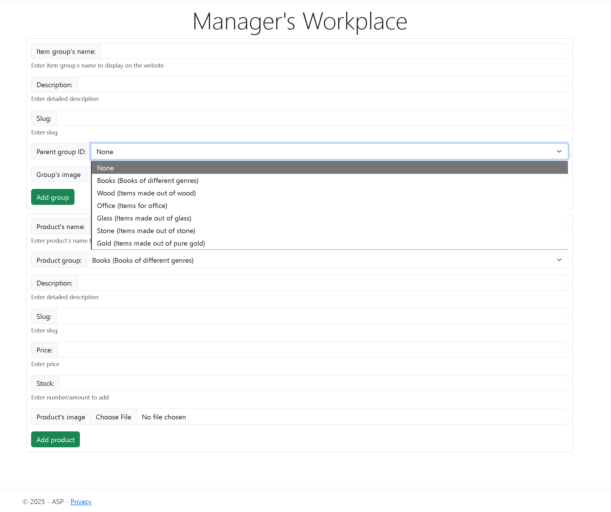
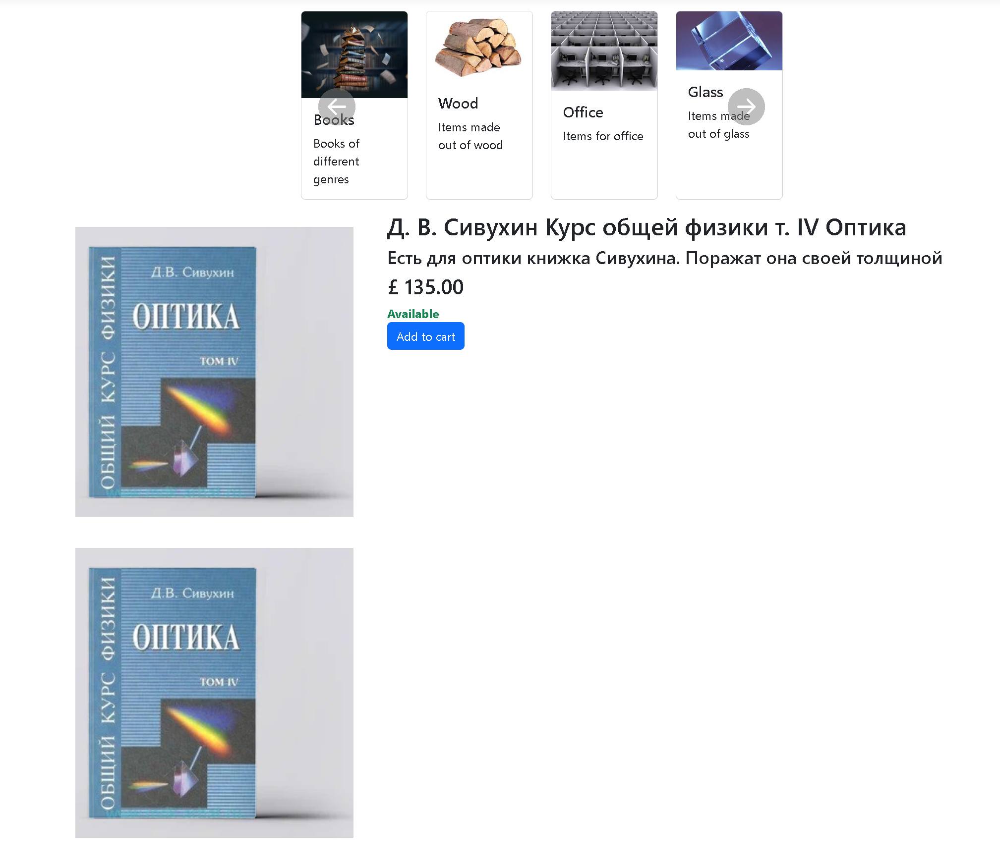
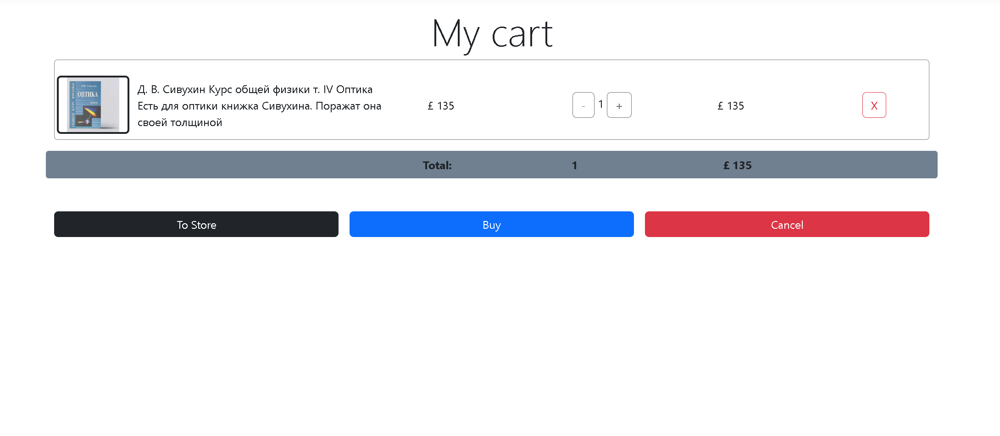
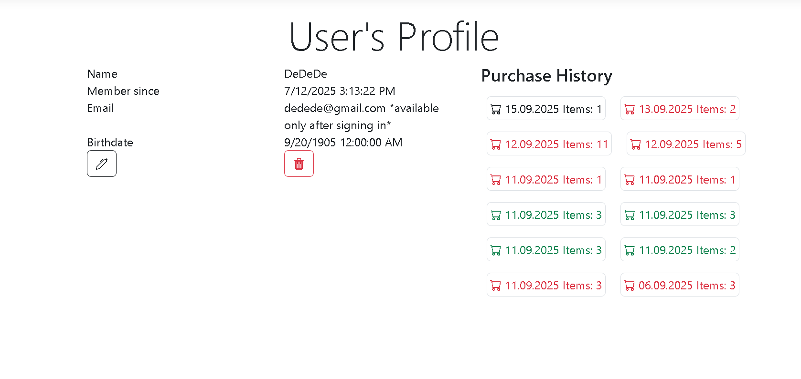
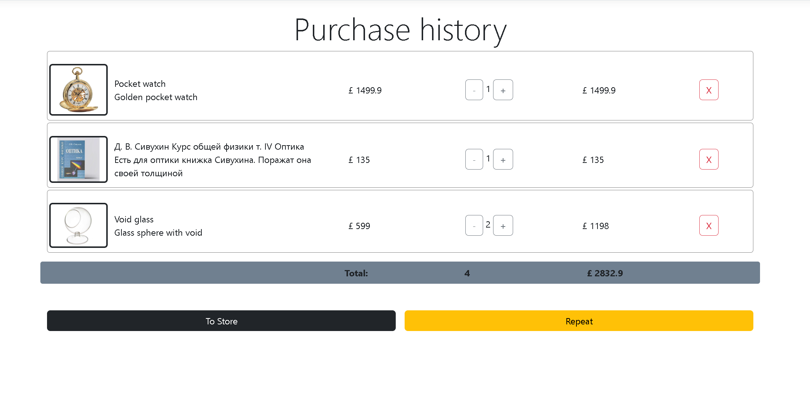

### Display
Elements of different lists are displayed via Display templates.
Display templates are ways of separating layout of a certain object (model). 
One creates DisplayTemplates (name is important) directory in View directory (Views/Shop).
Then one creates View itself. If name corresponds to the type name of the model then the choice of template is automatic
If the model type is complex (collection) or name is impossible, then template is declared directly @Html.FisplayFor(m => group, "Tepmlate name")

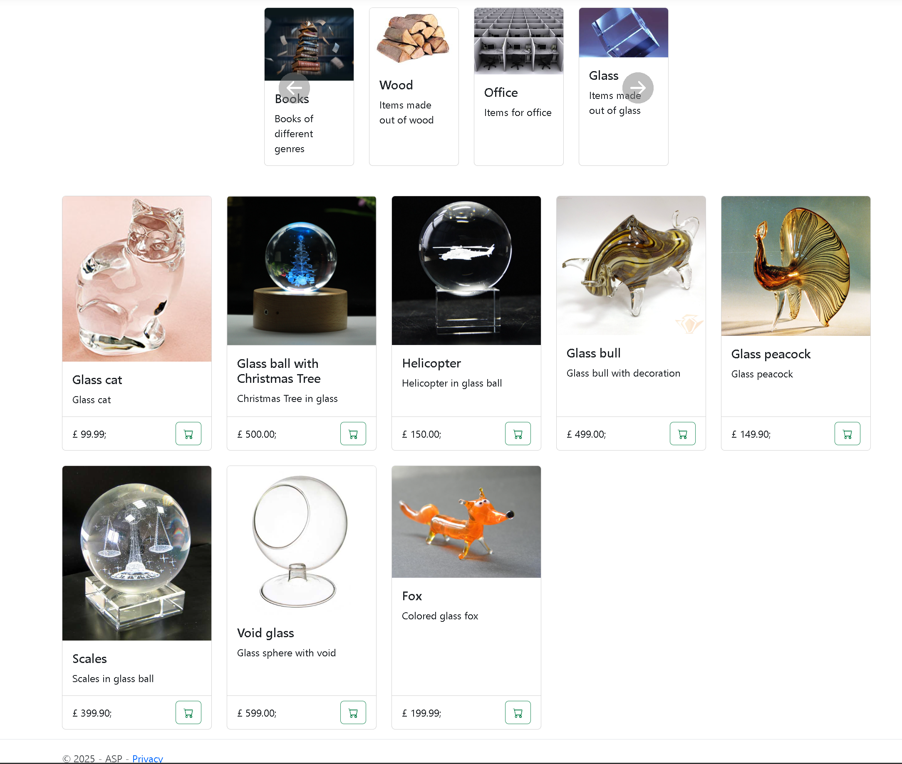

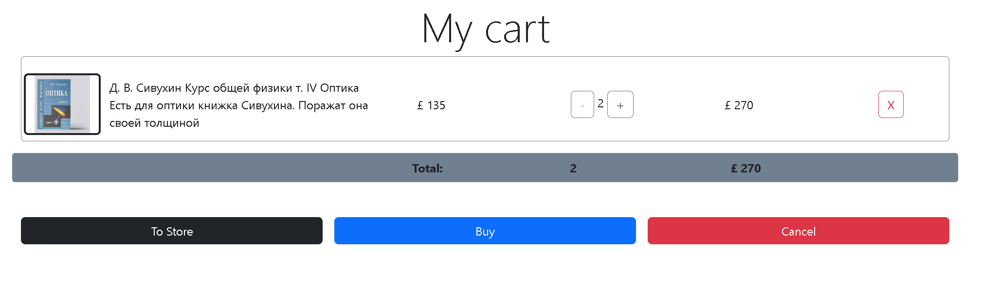
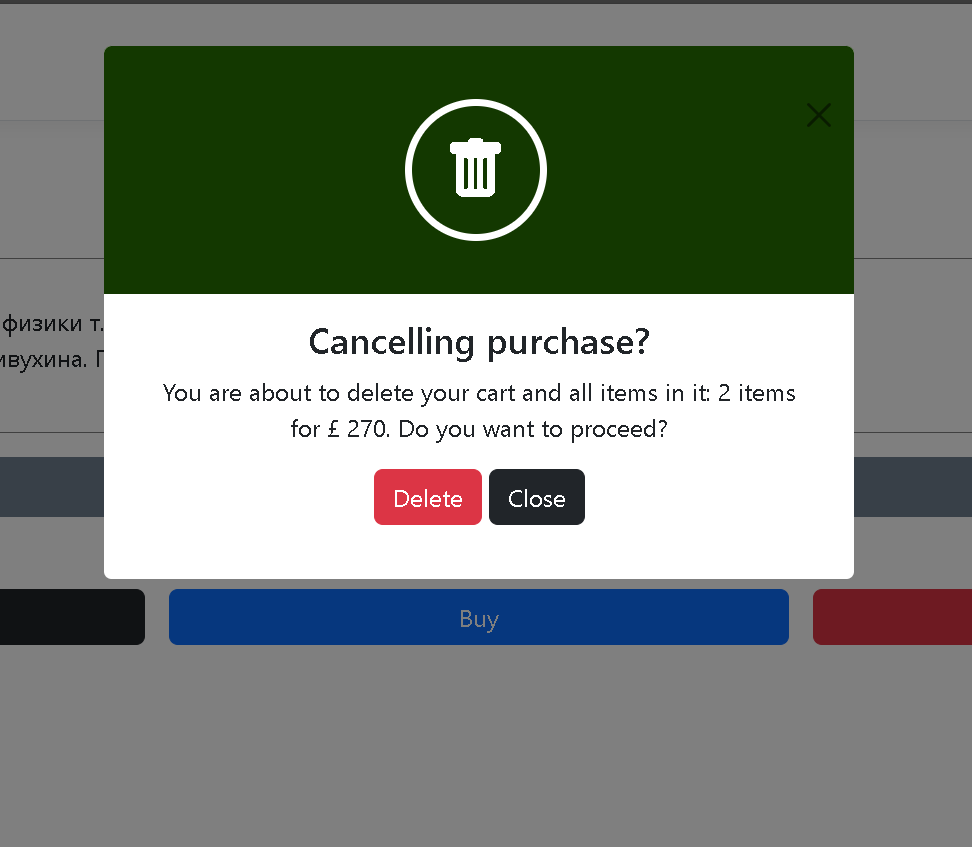

And of course there would be some tabs created purely for practical uses...
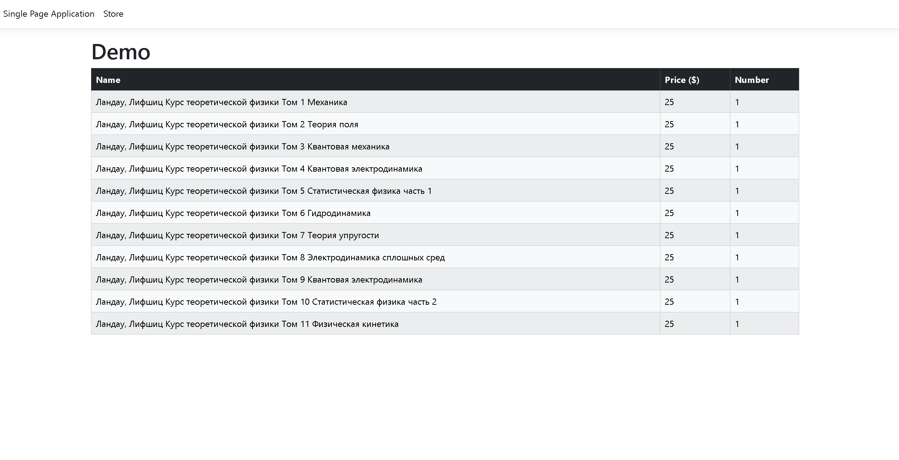
